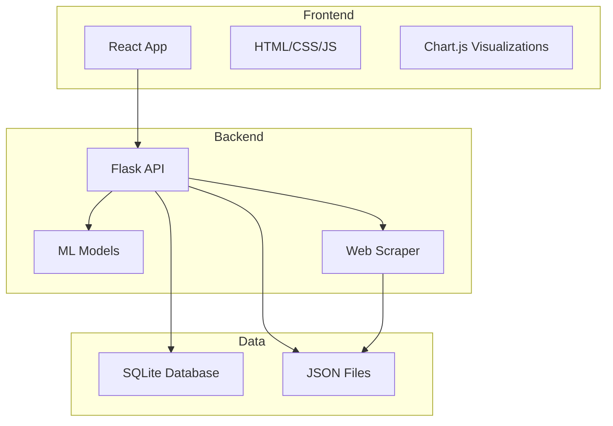

# Design Document

## Overview

The Student Abroad Platform is designed as a modern, scalable web application that combines comprehensive university data management with sophisticated AI-powered recommendation systems. The platform follows a microservices-inspired architecture with a React/Next.js frontend, Python backend services, and machine learning pipelines for intelligent university matching and admission probability prediction.

## Architecture

### High-Level Architecture



### Technology Stack

**Frontend:**
- React.js for component-based UI development
- HTML5 for semantic markup
- CSS3 for styling and responsive design
- JavaScript (ES6+) for interactive functionality
- Chart.js for data visualizations
- Axios for API communication

**Backend:**
- Flask for simple REST API development
- SQLite for lightweight database (can upgrade to MySQL later)
- Python for backend logic and data processing

**Machine Learning:**
- Scikit-learn for basic admission probability models
- Pandas for data manipulation
- Simple rule-based recommendation system initially

**Data Collection:**
- BeautifulSoup for web scraping
- JSON files for storing university data initially

## Components and Interfaces

### Frontend Components

#### 1. User Profile Management
- **ProfileForm Component**: Multi-step form for collecting student data
- **ProfileDashboard Component**: Overview of user profile and quick stats
- **ProfileEdit Component**: Inline editing capabilities for profile updates

#### 2. University Search & Browse
- **UniversitySearch Component**: Advanced search with filters and sorting
- **UniversityCard Component**: Compact university information display
- **UniversityDetail Component**: Comprehensive university profile view
- **FilterPanel Component**: Dynamic filtering interface

#### 3. Recommendation System
- **RecommendationDashboard Component**: Personalized university suggestions
- **AdmissionProbability Component**: Visual probability indicators
- **UniversityComparison Component**: Side-by-side university comparison
- **RecommendationExplanation Component**: AI decision reasoning display

#### 4. Visualization & Analytics
- **CostAnalysisChart Component**: Interactive cost breakdown charts
- **AdmissionTrendsChart Component**: Historical admission data visualization
- **ComparisonMatrix Component**: Multi-dimensional university comparison
- **ProgressTracker Component**: Application progress visualization

### Backend Services

#### 1. User Service
```python
class UserService:
    def create_user(user_data: dict) -> dict
    def update_profile(user_id: int, updates: dict) -> dict
    def get_user_profile(user_id: int) -> dict
    def authenticate_user(email: str, password: str) -> dict
```

#### 2. University Service
```python
class UniversityService:
    def search_universities(filters: dict) -> list
    def get_university_by_id(university_id: int) -> dict
    def get_all_universities() -> list
    def filter_by_criteria(criteria: dict) -> list
```

#### 3. Recommendation Service
```python
class RecommendationService:
    def generate_recommendations(user_profile: dict) -> list
    def calculate_admission_probability(user_data: dict, university: dict) -> float
    def rank_universities(user_profile: dict, universities: list) -> list
```

#### 4. ML Service
```python
class MLService:
    def predict_admission(student_features: dict, university_features: dict) -> dict
    def estimate_costs(user_budget: float, university_costs: dict) -> dict
    def load_models() -> dict
```

### API Endpoints

#### User Management
- `POST /api/register` - User registration
- `POST /api/login` - User authentication
- `GET /api/profile` - Get user profile
- `PUT /api/profile` - Update user profile

#### University Data
- `GET /api/universities` - Get all universities with optional filters
- `GET /api/universities/<id>` - Get university details
- `GET /api/countries` - Get available countries
- `GET /api/fields` - Get available fields of study

#### Recommendations
- `POST /api/recommendations` - Get personalized recommendations
- `POST /api/predict` - Get admission probability prediction
- `POST /api/compare` - Compare selected universities

## Data Models

### Data Models

#### User Model (SQLite)
```sql
CREATE TABLE users (
    id INTEGER PRIMARY KEY,
    email TEXT UNIQUE NOT NULL,
    password_hash TEXT NOT NULL,
    cgpa REAL,
    gre_score INTEGER,
    ielts_score REAL,
    toefl_score INTEGER,
    field_of_study TEXT,
    preferred_countries TEXT,
    budget_min REAL,
    budget_max REAL,
    created_at TIMESTAMP DEFAULT CURRENT_TIMESTAMP
);
```

#### University Model (JSON)
```json
{
    "id": 1,
    "name": "Harvard University",
    "country": "USA",
    "city": "Cambridge",
    "ranking": 1,
    "field": "Computer Science",
    "tuition_fee": 50000,
    "living_cost": 20000,
    "application_fee": 100,
    "min_cgpa": 3.7,
    "min_gre": 320,
    "min_ielts": 7.0,
    "min_toefl": 100,
    "acceptance_rate": 0.05
}
```

#### Recommendation Model
```python
{
    "university_id": 1,
    "university_name": "Harvard University",
    "admission_probability": 0.75,
    "cost_fit_score": 0.60,
    "overall_score": 0.68,
    "reasons": ["Strong academic match", "Good research opportunities"]
}
```

## Error Handling

### Frontend Error Handling
- **Network Errors**: Retry mechanisms with exponential backoff
- **Validation Errors**: Real-time form validation with clear error messages
- **Authentication Errors**: Automatic token refresh and login redirects
- **Data Loading Errors**: Graceful fallbacks and skeleton loading states

### Backend Error Handling
- **Input Validation**: Comprehensive request validation using Pydantic models
- **Database Errors**: Connection pooling and automatic retry mechanisms
- **ML Model Errors**: Fallback to rule-based recommendations when ML fails
- **External API Errors**: Circuit breaker pattern for external service calls

### Error Response Format
```python
class ErrorResponse:
    error_code: str
    message: str
    details: Optional[dict]
    timestamp: datetime
    request_id: str
```

## Testing Strategy

### Frontend Testing
- **Unit Tests**: Jest and React Testing Library for component testing
- **Integration Tests**: Cypress for end-to-end user journey testing
- **Visual Regression Tests**: Percy or Chromatic for UI consistency
- **Performance Tests**: Lighthouse CI for performance monitoring

### Backend Testing
- **Unit Tests**: Pytest for individual service and function testing
- **Integration Tests**: TestContainers for database integration testing
- **API Tests**: Postman/Newman for API endpoint testing
- **Load Tests**: Locust for performance and scalability testing

### ML Model Testing
- **Model Validation**: Cross-validation and holdout testing
- **Data Quality Tests**: Automated data validation pipelines
- **Prediction Accuracy Tests**: A/B testing for model performance
- **Bias Detection Tests**: Fairness testing across different demographics

### Test Data Management
- **Synthetic Data Generation**: Faker for generating test user profiles
- **University Data Mocking**: Comprehensive mock university database
- **Prediction Mocking**: Deterministic ML model responses for testing
- **Performance Baselines**: Established benchmarks for response times

## Security Considerations

### Authentication & Authorization
- JWT-based authentication with refresh token rotation
- Role-based access control (RBAC) for different user types
- OAuth2 integration for social login options
- Multi-factor authentication for sensitive operations

### Data Protection
- Encryption at rest for sensitive user data
- HTTPS enforcement for all communications
- Input sanitization and SQL injection prevention
- GDPR compliance with data anonymization capabilities

### API Security
- Rate limiting to prevent abuse
- CORS configuration for cross-origin requests
- API key management for external service access
- Request/response logging for audit trails

## Project File Structure

```
student-abroad-platform/
├── frontend/                        # React Frontend
│   ├── public/
│   │   ├── index.html              # Main HTML file
│   │   ├── images/
│   │   ├── icons/
│   │   └── favicon.ico
│   ├── src/
│   │   ├── components/             # React components
│   │   │   ├── common/
│   │   │   │   ├── Header.js
│   │   │   │   ├── Footer.js
│   │   │   │   ├── LoadingSpinner.js
│   │   │   │   └── Navigation.js
│   │   │   ├── profile/
│   │   │   │   ├── ProfileForm.js
│   │   │   │   ├── ProfileDashboard.js
│   │   │   │   └── ProfileEdit.js
│   │   │   ├── university/
│   │   │   │   ├── UniversitySearch.js
│   │   │   │   ├── UniversityCard.js
│   │   │   │   ├── UniversityDetail.js
│   │   │   │   └── FilterPanel.js
│   │   │   ├── recommendations/
│   │   │   │   ├── RecommendationList.js
│   │   │   │   ├── AdmissionProbability.js
│   │   │   │   └── UniversityComparison.js
│   │   │   └── charts/
│   │   │       ├── CostChart.js
│   │   │       └── ProbabilityChart.js
│   │   ├── pages/                  # Page components
│   │   │   ├── HomePage.js
│   │   │   ├── LoginPage.js
│   │   │   ├── RegisterPage.js
│   │   │   ├── ProfilePage.js
│   │   │   ├── SearchPage.js
│   │   │   ├── RecommendationsPage.js
│   │   │   └── UniversityDetailPage.js
│   │   ├── services/               # API services
│   │   │   ├── api.js              # Base API setup
│   │   │   ├── authService.js
│   │   │   ├── universityService.js
│   │   │   └── recommendationService.js
│   │   ├── utils/                  # Utility functions
│   │   │   ├── constants.js
│   │   │   ├── helpers.js
│   │   │   └── validators.js
│   │   ├── styles/                 # CSS files
│   │   │   ├── index.css           # Global styles
│   │   │   ├── components.css      # Component styles
│   │   │   ├── pages.css           # Page-specific styles
│   │   │   └── responsive.css      # Mobile responsiveness
│   │   ├── context/                # React context
│   │   │   ├── AuthContext.js
│   │   │   └── UserContext.js
│   │   ├── App.js                  # Main App component
│   │   └── index.js                # Entry point
│   ├── package.json
│   └── .env
│
├── backend/                        # Flask Backend
│   ├── app/
│   │   ├── __init__.py
│   │   ├── app.py                  # Flask application
│   │   ├── models/                 # Data models
│   │   │   ├── __init__.py
│   │   │   ├── user.py
│   │   │   ├── university.py
│   │   │   └── recommendation.py
│   │   ├── routes/                 # API routes
│   │   │   ├── __init__.py
│   │   │   ├── auth.py
│   │   │   ├── users.py
│   │   │   ├── universities.py
│   │   │   └── recommendations.py
│   │   ├── services/               # Business logic
│   │   │   ├── __init__.py
│   │   │   ├── user_service.py
│   │   │   ├── university_service.py
│   │   │   ├── recommendation_service.py
│   │   │   └── ml_service.py
│   │   ├── ml/                     # Machine Learning
│   │   │   ├── __init__.py
│   │   │   ├── admission_predictor.py
│   │   │   ├── cost_estimator.py
│   │   │   └── recommendation_engine.py
│   │   ├── scraping/               # Web scraping
│   │   │   ├── __init__.py
│   │   │   ├── university_scraper.py
│   │   │   └── data_processor.py
│   │   ├── utils/                  # Utilities
│   │   │   ├── __init__.py
│   │   │   ├── helpers.py
│   │   │   └── validators.py
│   │   └── config.py               # Configuration
│   ├── data/                       # Data files
│   │   ├── universities.json       # University database
│   │   ├── countries.json          # Country data
│   │   └── fields.json             # Fields of study
│   ├── database/
│   │   └── student_abroad.db       # SQLite database
│   ├── requirements.txt
│   └── .env
│
├── scripts/                        # Utility scripts
│   ├── setup.py                    # Project setup
│   ├── scrape_data.py             # Data collection
│   └── train_models.py            # ML model training
│
├── docs/                          # Documentation
│   ├── README.md
│   ├── API.md                     # API documentation
│   └── SETUP.md                   # Setup instructions
│
├── .gitignore
├── README.md
└── package.json                   # Root package.json for scripts
```

## File Structure Explanation

**Frontend Structure:**
- **Components**: Organized by feature (profile, university, recommendations, charts)
- **Pages**: Next.js file-based routing with dynamic routes for universities
- **Hooks**: Custom React hooks for data fetching and state management
- **Services**: API communication layer separated from components
- **Utils**: Shared utility functions and constants

**Backend Structure:**
- **Models**: SQLAlchemy/MongoDB models for data persistence
- **Schemas**: Pydantic models for request/response validation
- **Services**: Business logic separated from API routes
- **API**: FastAPI route handlers organized by feature
- **ML**: Complete machine learning pipeline with training and inference
- **Scraping**: Web scraping infrastructure with schedulers

**Data Organization:**
- **Raw**: Unprocessed scraped data
- **Processed**: Clean, structured data ready for ML
- **Models**: Trained ML models with versioning
- **Scripts**: Data processing and model training scripts

**Database Management:**
- **Migrations**: Version-controlled database schema changes
- **Seeds**: Development data for testing
- **Schemas**: Database structure definitions

**Deployment & Operations:**
- **Docker**: Containerization for all services
- **Kubernetes**: Orchestration for production deployment
- **Terraform**: Infrastructure as code for cloud resources
- **Monitoring**: Observability stack with Prometheus and Grafana

**Simplified File Structure Explanation:**

**Frontend Structure:**
- **Components**: React components organized by feature (profile, university, recommendations)
- **Pages**: Page-level components for different routes
- **Services**: API communication functions
- **Styles**: CSS files for styling (no framework dependencies)
- **Utils**: Helper functions and constants

**Backend Structure:**
- **Models**: Simple Python classes for data handling
- **Routes**: Flask route handlers for API endpoints
- **Services**: Business logic functions
- **ML**: Basic machine learning models and prediction logic
- **Scraping**: Web scraping scripts for data collection

**Data Storage:**
- **SQLite**: Simple file-based database for user data
- **JSON Files**: University data stored in JSON format
- **Scripts**: Utility scripts for setup and data processing

**Key Simplifications:**
- Single database (SQLite) instead of multiple databases
- JSON files for university data instead of complex database schemas
- Basic CSS instead of CSS frameworks
- Simple Flask routes instead of complex API architecture
- Minimal ML models focusing on core functionality

This simplified structure maintains core functionality while being much easier to develop and maintain.

## Performance Optimization

### Frontend Optimization
- Code splitting and lazy loading for optimal bundle sizes
- Image optimization and CDN integration
- Service worker implementation for offline capabilities
- Memoization and React optimization techniques

### Backend Optimization
- Database query optimization and indexing strategies
- Redis caching for frequently accessed data
- Asynchronous processing for heavy computations
- Connection pooling for database efficiency

### ML Model Optimization
- Model caching for repeated predictions
- Batch processing for multiple recommendations
- Feature preprocessing optimization
- Model versioning and A/B testing infrastructure
<!-- 
Architecture Explanation
Frontend Layer (React/Next.js):

React/Next.js: Provides server-side rendering for better SEO and performance, crucial for a platform students will discover through search
Tailwind CSS: Utility-first CSS framework that allows rapid UI development and consistent styling
Chart.js/D3.js: Creates interactive visualizations for admission probabilities, cost comparisons, and university rankings
Backend Services: The design uses a service-oriented approach where each major function has its own service:

User Management Service: Handles student profiles, authentication, and preferences
University Data Service: Manages the university database, search functionality, and data updates
Recommendation Engine: The core AI system that matches students with universities
ML Prediction Service: Dedicated service for machine learning models (admission probability, cost estimation)
Cost Analysis Service: Handles financial calculations, currency conversions, and budget matching
Database Strategy:

MySQL: Stores structured data like user profiles, university basic info, and relationships
MongoDB: Stores flexible data like detailed university descriptions, reviews, and dynamic content that varies by university
Redis: Caches frequently accessed data like search results and recommendations for faster response times
Key Design Decisions
Why Microservices Approach?

Each service can be scaled independently (e.g., if ML predictions are heavily used)
Different teams can work on different services
Easier to maintain and update individual components
Why Hybrid Database?

MySQL ensures data consistency for critical information like user profiles and university core data
MongoDB provides flexibility for varying university information structures
Redis provides sub-second response times for recommendations
ML Integration Strategy:

Separate ML service allows for model updates without affecting other services
Caching predictions reduces computation time for similar student profiles
A/B testing infrastructure lets you improve recommendations over time
API Design:

RESTful endpoints make it easy for frontend to consume data
Clear separation between user data, university data, and recommendations
Standardized error responses help with debugging and user experience -->